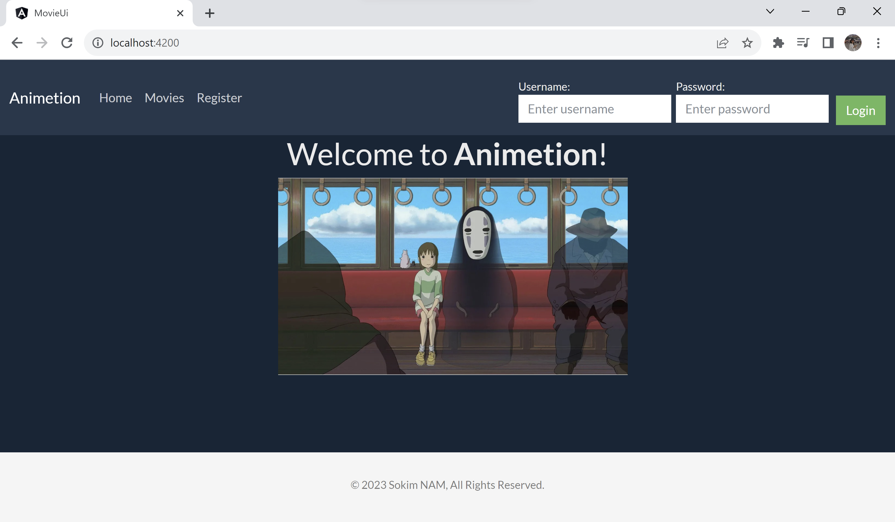

# PersonalHobbyProject-Animetion
I am thrilled to introduce my personal project, an innovative Movie Watchlist Application named <b>Animetion</b>designed to keep track of movies that users have watched. This project showcases my passion for web development and leverages cutting-edge technologies, including <b>Express</b>, <b>Angular</b>, <b>NodeJS</b>, and <b>MongoDB</b> to deliver a <i>seamless</i> and <i>user-friendly</i> experience.

As an avid movie enthusiast, I have often found myself struggling to remember the countless movies I have watched over the years. This inspired me to create a solution that not only addresses my personal need but also offers a valuable tool for other movie enthusiasts who share the same challenge.

<b>Key Features:</b>

<ol>
    <li><b>User-Friendly Interface:</b> The application boasts an intuitive and user-friendly interface, ensuring effortless navigation and interaction with the platform.</li>
    <li><b>Movie Database Integration:</b> Leveraging the power of MongoDB, the application seamlessly integrates with a vast movie database, enabling users to search and select movies from an extensive collection.</li>
    <li><b>Watchlist Functionality:</b> Users can easily add movies to their watchlist with a simple click, creating a personalized collection of watched movies for future reference.</li>
    <li><b>Responsive Design:</b> The Movie Watchlist Application is meticulously designed to be responsive across various devices, ensuring a seamless experience on desktops, tablets, and mobile phones.</li>
</ol>

